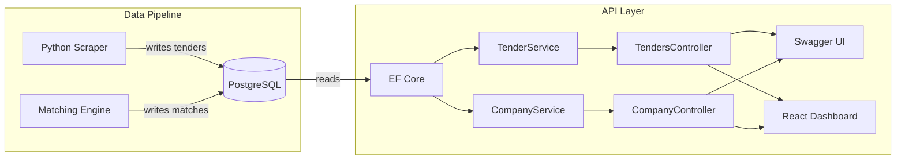
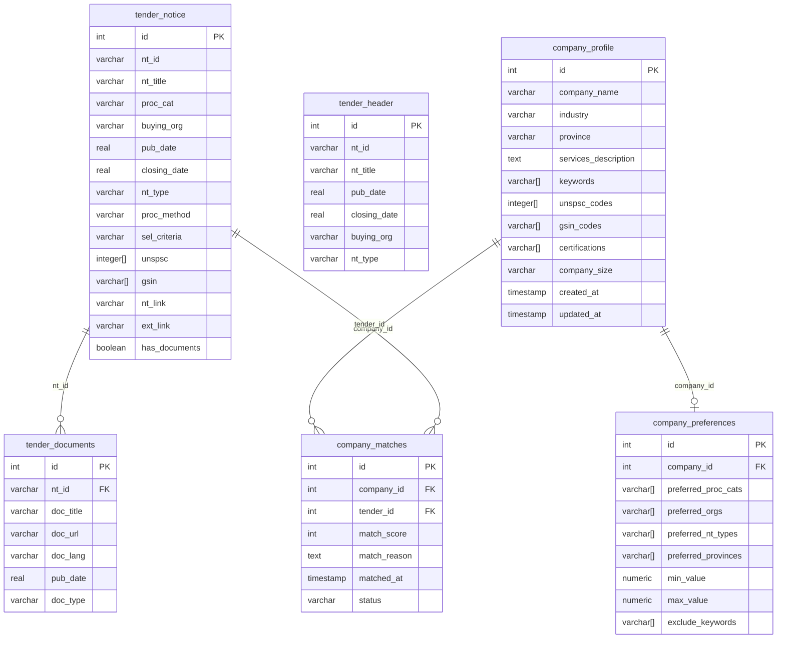

# ProcurePortal API

ASP.NET Core Web API that serves Canadian procurement tender data scraped by the [ProcurePortal Scraper](https://github.com/AGabtni/Procurements_Scrapper). Provides search, filtering, pagination, and tender detail endpoints over a shared PostgreSQL database.

## Architecture



## Tech Stack

- **ASP.NET Core 9** Web API
- **Entity Framework Core 9** + Npgsql (PostgreSQL)
- **Swashbuckle** (Swagger / OpenAPI)
- **PostgreSQL 16** (shared with Python scraper)
- **JWT Bearer** authentication (BCrypt password hashing)
- **MailKit** (SMTP email — confirmation + match notifications)

## Project Structure

```
├── Controllers/
│   ├── TendersController.cs     # Tender search/filter/detail endpoints
│   ├── CompanyController.cs     # Company profile, preferences, matches
│   ├── AuthController.cs        # Register, login, email confirmation, settings
│   └── NotificationsController.cs # Internal webhook for match notifications
├── Services/
│   ├── TenderService.cs         # Tender queries and mapping
│   ├── CompanyService.cs        # Profile CRUD, preferences, match queries
│   ├── AuthService.cs           # User registration, login, JWT, email settings
│   └── EmailService.cs          # SMTP email (confirmation + match notifications)
├── Models/
│   ├── TenderNotice.cs          # EF model — tender_notice table
│   ├── TenderHeader.cs          # EF model — tender_header table
│   ├── TenderDocument.cs        # EF model — tender_documents table
│   ├── CompanyProfile.cs        # EF model — company_profile table
│   ├── CompanyPreferences.cs    # EF model — company_preferences table
│   ├── CompanyMatch.cs          # EF model — company_matches table
│   └── AppUser.cs               # EF model — app_users table
├── DTOs/
│   ├── TenderDtos.cs            # Tender request/response shapes
│   ├── CompanyDtos.cs           # Company/match request/response shapes
│   └── AuthDtos.cs              # Auth request/response shapes
├── Data/
│   └── ProcurementsDbContext.cs  # EF DbContext (7 DbSets)
├── Program.cs                   # App startup + DI configuration
├── appsettings.json             # Base config (placeholders for secrets)
├── appsettings.Development.json # Local secrets (gitignored)
└── ProcurePortal.API.csproj     # Project file + NuGet packages
```

## API Endpoints

### Tenders

| Method | Route | Description |
|--------|-------|-------------|
| `GET` | `/api/tenders` | Search, filter, and paginate tenders |
| `GET` | `/api/tenders/{id}` | Tender detail by database ID (includes documents) |
| `GET` | `/api/tenders/by-notice/{noticeId}` | Tender detail by notice ID (e.g. `PW-24-01234567`) |
| `GET` | `/api/tenders/categories` | List all procurement categories |
| `GET` | `/api/tenders/notice-types` | List all notice types |

### Company Profiles & Matching

| Method | Route | Description |
|--------|-------|-------------|
| `GET` | `/api/company` | List all company profiles |
| `GET` | `/api/company/{id}` | Get profile by ID (includes preferences) |
| `POST` | `/api/company` | Create profile (+ optional preferences) |
| `PUT` | `/api/company/{id}` | Update profile fields |
| `DELETE` | `/api/company/{id}` | Delete profile (cascades prefs + matches) |
| `GET` | `/api/company/{id}/preferences` | Get matching preferences |
| `PUT` | `/api/company/{id}/preferences` | Create or update preferences |
| `GET` | `/api/company/{id}/matches` | List matches (filter: `?status=saved&limit=50`) |
| `GET` | `/api/company/{id}/matches/stats` | Match stats (counts, avg score, high-score count) |
| `PATCH` | `/api/company/{id}/matches/{matchId}/status` | Update match status (new/viewed/saved/dismissed) |

### Authentication

| Method | Route | Description |
|--------|-------|-------------|
| `POST` | `/api/auth/register` | Register new user (username, email, password) |
| `POST` | `/api/auth/login` | Login (returns JWT token) |
| `POST` | `/api/auth/send-confirmation` | Send email confirmation link |
| `GET` | `/api/auth/confirm-email` | Confirm email via token |
| `GET` | `/api/auth/settings` | Get user notification settings |
| `PUT` | `/api/auth/settings` | Update notification settings |

### Notifications (Internal)

| Method | Route | Description |
|--------|-------|-------------|
| `POST` | `/api/notifications/match-complete` | Webhook called by Python worker after matching (secured by `X-Internal-Key` header) |

### Search Parameters (`GET /api/tenders`)

| Parameter | Type | Default | Description |
|-----------|------|---------|-------------|
| `keyword` | string | — | Search in title, organization, notice ID |
| `category` | string | — | Filter by procurement category |
| `organization` | string | — | Filter by buying organization |
| `noticeType` | string | — | Filter by notice type (RFP, RFQ, etc.) |
| `openOnly` | bool | `true` | Only return tenders with future closing dates |
| `page` | int | `1` | Page number |
| `pageSize` | int | `20` | Results per page (max 100) |
| `sortBy` | string | `closing_date` | Sort field: `closing_date`, `title`, `pub_date`, `organization` |
| `sortDesc` | bool | `false` | Sort descending |

### Example Requests

```bash
# Search for construction tenders
curl "http://localhost:5009/api/tenders?keyword=construction&pageSize=5"

# Get tender detail with documents
curl "http://localhost:5009/api/tenders/206"

# Filter by category, sorted by publication date
curl "http://localhost:5009/api/tenders?category=S&sortBy=pub_date&sortDesc=true"
```

## Setup

### Prerequisites

- [.NET 9 SDK](https://dotnet.microsoft.com/download)
- PostgreSQL 16 (with the procurements database from the Scraper project)

### Installation

```bash
git clone <repo-url>
cd Procurements_Analyzer_API
dotnet restore
```

### Configuration

Create `appsettings.Development.json` (gitignored):

```json
{
  "ConnectionStrings": {
    "DefaultConnection": "Host=localhost;Port=5432;Database=procurements;Username=procurements_dev;Password=YOUR_PASSWORD"
  },
  "Jwt": {
    "Key": "YOUR_JWT_SECRET_KEY_MIN_32_CHARS"
  },
  "App": {
    "InternalApiKey": "YOUR_INTERNAL_API_KEY"
  },
  "Smtp": {
    "Host": "smtp.gmail.com",
    "Port": "587",
    "Username": "YOUR_EMAIL@gmail.com",
    "Password": "YOUR_APP_PASSWORD",
    "FromEmail": "YOUR_EMAIL@gmail.com",
    "FromName": "ProcurePortal"
  }
}
```

### Run

```bash
dotnet run
```

Open `http://localhost:5009` for Swagger UI.

## Database Schema

The API reads from tables written by the Python scraper:



## Roadmap

- [x] REST API with search/filter/pagination (5 tender endpoints)
- [x] Swagger UI for interactive testing
- [x] Company profile CRUD (5 endpoints)
- [x] Matching preferences management (2 endpoints)
- [x] Match results + stats + status management (3 endpoints)
- [x] Region of delivery/opportunity in tender detail
- [x] JWT authentication (register, login, token-gated endpoints)
- [x] Email confirmation (MailKit/SMTP, token-based flow)
- [x] Match notification emails (internal webhook from Python worker)
- [x] Notification settings (opt-in/out per user)
- [x] Secrets moved to `appsettings.Development.json` (gitignored)
- [x] Role-based authorization (admin vs user)
- [ ] Rate limiting
- [ ] Docker containerization
