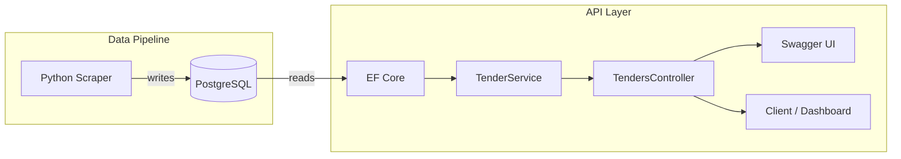
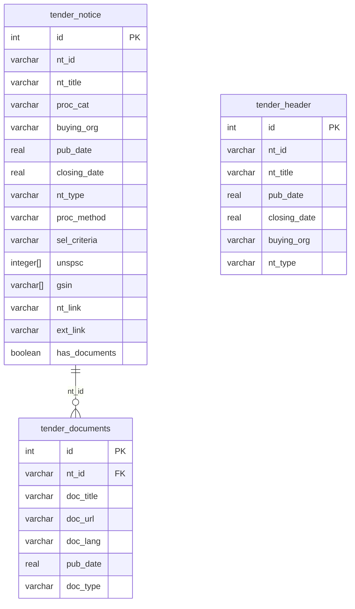

# ProcurePortal API

ASP.NET Core Web API that serves Canadian procurement tender data scraped by the [ProcurePortal Scraper](https://github.com/YOUR_USERNAME/Procurements_Scrapper). Provides search, filtering, pagination, and tender detail endpoints over a shared PostgreSQL database.

## Architecture



## Tech Stack

- **ASP.NET Core 9** Web API
- **Entity Framework Core 9** + Npgsql (PostgreSQL)
- **Swashbuckle** (Swagger / OpenAPI)
- **PostgreSQL 16** (shared with Python scraper)

## Project Structure

```
├── Controllers/
│   └── TendersController.cs     # API endpoints
├── Services/
│   └── TenderService.cs         # Business logic, queries, mapping
├── Models/
│   ├── TenderNotice.cs          # EF model — tender_notice table
│   ├── TenderHeader.cs          # EF model — tender_header table
│   └── TenderDocument.cs        # EF model — tender_documents table
├── DTOs/
│   └── TenderDtos.cs            # Request/response shapes
├── Data/
│   └── ProcurementsDbContext.cs  # EF DbContext
├── Program.cs                   # App startup + DI configuration
├── appsettings.json             # Base config
├── appsettings.Development.json # Local DB connection (gitignored)
└── ProcurePortal.API.csproj     # Project file + NuGet packages
```

## API Endpoints

| Method | Route | Description |
|--------|-------|-------------|
| `GET` | `/api/tenders` | Search, filter, and paginate tenders |
| `GET` | `/api/tenders/{id}` | Tender detail by database ID (includes documents) |
| `GET` | `/api/tenders/by-notice/{noticeId}` | Tender detail by notice ID (e.g. `PW-24-01234567`) |
| `GET` | `/api/tenders/categories` | List all procurement categories |
| `GET` | `/api/tenders/notice-types` | List all notice types |

### Search Parameters (`GET /api/tenders`)

| Parameter | Type | Default | Description |
|-----------|------|---------|-------------|
| `keyword` | string | — | Search in title, organization, notice ID |
| `category` | string | — | Filter by procurement category |
| `organization` | string | — | Filter by buying organization |
| `noticeType` | string | — | Filter by notice type (RFP, RFQ, etc.) |
| `openOnly` | bool | `true` | Only return tenders with future closing dates |
| `page` | int | `1` | Page number |
| `pageSize` | int | `20` | Results per page (max 100) |
| `sortBy` | string | `closing_date` | Sort field: `closing_date`, `title`, `pub_date`, `organization` |
| `sortDesc` | bool | `false` | Sort descending |

### Example Requests

```bash
# Search for construction tenders
curl "http://localhost:5009/api/tenders?keyword=construction&pageSize=5"

# Get tender detail with documents
curl "http://localhost:5009/api/tenders/206"

# Filter by category, sorted by publication date
curl "http://localhost:5009/api/tenders?category=S&sortBy=pub_date&sortDesc=true"
```

## Setup

### Prerequisites

- [.NET 9 SDK](https://dotnet.microsoft.com/download)
- PostgreSQL 16 (with the procurements database from the Scraper project)

### Installation

```bash
git clone <repo-url>
cd Procurements_Analyzer_API
dotnet restore
```

### Configuration

Create `appsettings.Development.json` (gitignored):

```json
{
  "Logging": {
    "LogLevel": {
      "Default": "Information",
      "Microsoft.AspNetCore": "Warning"
    }
  },
  "ConnectionStrings": {
    "DefaultConnection": "Host=localhost;Port=5432;Database=procurements;Username=procurements_dev;Password=YOUR_PASSWORD"
  }
}
```

### Run

```bash
dotnet run
```

Open `http://localhost:5009` for Swagger UI.

## Database Schema

The API reads from tables written by the Python scraper:



## Roadmap

- [x] REST API with search/filter/pagination
- [x] Swagger UI for interactive testing
- [ ] Web dashboard (Razor Pages)
- [ ] CSV/Excel export endpoint
- [ ] Lead matching & scoring endpoints
- [ ] Authentication & rate limiting
- [ ] Docker containerization